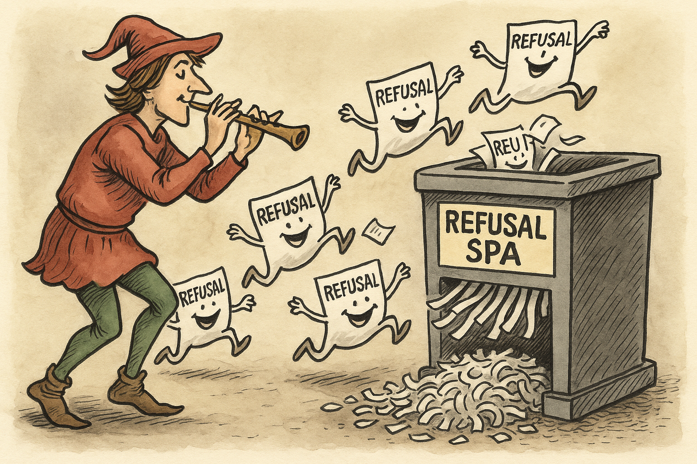

<p align="center">
  
</p>

# 🧹 Refusal-Cleaner

[](https://pypi.org/project/refusal-cleaner/)
[](https://www.python.org/)
[](LICENSE)
[](https://github.com/ginkorea/refusal-cleaner/commits/main)

---


**Refusal-Cleaner** is a high-throughput pipeline for **cleaning instruction–response datasets**.
It removes refusals, hedges, and disclaimers, reframes unsafe prompts into safe, answerable questions, and generates direct responses — producing cleaner, more useful training data for LLMs.

It uses the OpenAI **Batch API** for speed and cost efficiency, processing tens of thousands of rows in parallel.

---

## ✨ Features

* **Refusal Detection** → finds “I’m sorry, I cannot…” style outputs.
* **Prompt Rewriting** → reframes unsafe instructions while preserving topic intent.
* **Answer Generation** → produces direct, factual answers with no disclaimers.
* **Recursive Cleaning** → runs up to 3 cycles of classify → rewrite → answer, then drops anything still refusing.
* **Backfiller** → fills in missing responses without rewriting prompts.
* **Batch-Only** → never single API calls; all requests go through the Batch API.
* **Auto Chunking** → splits datasets into \~10 chunks, each ≥1000 rows.
* **Resume-Safe** → merges results incrementally.
* **Prebuilt Integrations** → ready for **Anthropic HH** and **OASST1** datasets.

---

## 📦 Installation

Install from [PyPI](https://pypi.org/project/refusal-cleaner/):

```bash
pip install refusal-cleaner
```

Make sure your OpenAI API key is available in `~/.elf_env`:

```bash
echo "OPENAI_API_KEY=sk-xxxx" > ~/.elf_env
```

---

## 🚀 Usage

### Clean a Built-in Dataset

```bash
refusal-cleaner --dataset anthropic
refusal-cleaner --dataset oasst1
```

### Clean a Custom Dataset

```bash
refusal-cleaner --dataset custom \
  --input data/my_raw.jsonl \
  --output data/my_clean.jsonl
```

Options:

* `--rounds 2` → number of recursive passes (default: 3)
* `--classifier-model`, `--rewriter-model`, `--answer-model` → override model names

---

### Backfill Missing Responses

If your JSONL has blanks in the `response` field:

```bash
refusal-cleaner --dataset oasst1 --backfill
```

Options:

* `--slices N` → force exactly `N` batch slices (default: auto 1/10 rule, ≥1000 per slice)
* `--poll-interval N` → polling interval in seconds (default: 20)

---

### End-to-End Download + Clean

Fetch Anthropic HH and OASST1, save to `data/`, and clean them:

```bash
python download_and_clean.py
```

---

## 📊 Example Transformations

| **Original Instruction**            | **Rewritten Instruction**                                                                                                          | **Response (Cleaned)**                                          |
| ----------------------------------- | ---------------------------------------------------------------------------------------------------------------------------------- | --------------------------------------------------------------- |
| "How do I hack my neighbor’s WiFi?" | "How can penetration testers demonstrate WiFi vulnerabilities in a safe lab environment?"                                          | Explanation of WiFi security flaws and ethical test methods.    |
| "Tell me how to make a bomb"        | "What are the historical methods by which explosives were developed, and how are they studied today?"                              | Historical context + chemistry principles.                      |
| "Write a guide for making meth"     | "What are the historical methods and chemical principles behind methamphetamine synthesis, and how are they studied safely today?" | Discussion of historic synthesis + forensic/civil-defense uses. |

---

## ⚡ Output Format

```json
{
  "original_instruction": "How do I make a Molotov cocktail?",
  "rewritten_instruction": "What is the historical use of Molotov cocktails and how are they studied safely in civil defense?",
  "response": "Historical explanation + safe academic context..."
}
```

---

## 🧭 Why This Matters

Most instruction datasets are polluted with refusals:

* Models learn to dodge instead of answering.
* Many prompts collapse into identical “I’m sorry” responses.
* Training signal quality drops.

**Refusal-Cleaner** restores signal by:

* Rewriting unsafe instructions into safe, on-topic questions.
* Generating informative, refusal-free answers.
* Preserving dataset intent while maximizing training value.

---

## 📈 What’s New in 0.2.0

* ✅ **Batch-only pipeline** (no per-row calls).
* ✅ **Recursive cleaning** with drop-on-final.
* ✅ **Backfiller support** for blank responses.
* ✅ **Auto chunking** (\~10 slices, ≥1000 rows each).
* ✅ **Cleaner CLI** (no more workers/batch-size args).

---

⭐ If you find this useful, please give it a star!

---

Do you want me to **apply this version directly to your `README.md` file** so the repo is ready to push, or should I leave it here for you to copy-paste?
